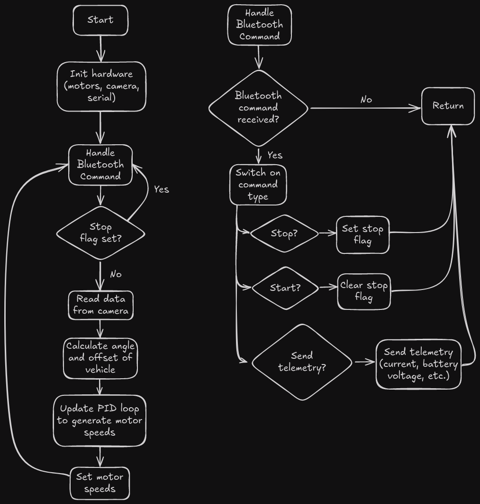
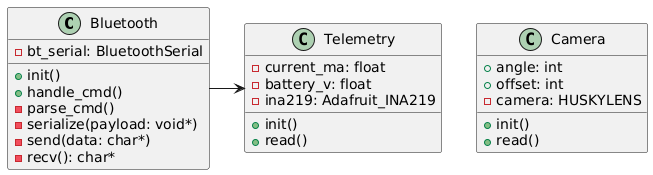

# Junior Design Project

## Where to find the code

The most up to date code includes everything in the [`src`](src) directory.
The [`telemetry`](src/telemetry.h) files are for gathering telemetry to be sent from the device,
like the current use or battery voltage.
The [`camera`](src/camera.h) files are for reading from the HuskyLens camera and calculating
the angle/offset of the vehicle relative to the line.
The [`bt`](src/bt.h) files are for providing an API over Bluetooth to control the vehicle.
The [`main`](src/main.ino) files hold the setup and loop functions.

## State Diagram

## UML Diagram

## Software Documentation Plan

The device device provides an API for use over Bluetooth. The specifications
are still in the works, but it will allow language-agnostic programming
support, and easy integration into a GUI, such as a web or mobile app.

This API will provide detailed information about the status of the vehicle and
its power supply, which will be educational for the students because it will
introduce them to concepts such as power, voltage, and current. Being able to
manipulate the vehicle and observe how its power supply reacts will help them
develop an intuition for these concepts. This also ties into the requirement
that user will be able to see the instantaneous power draw over time during the
competition.

### API Functions

| Command   | Description                                   |
|-----------|-----------------------------------------------|
| START     | Starts the vehicle                            |
| STOP      | Stops the vehicle                             |
| TELEMETRY | Requests telemetry data from the vehicle      |
|           | This includes battery voltage, current, power |
