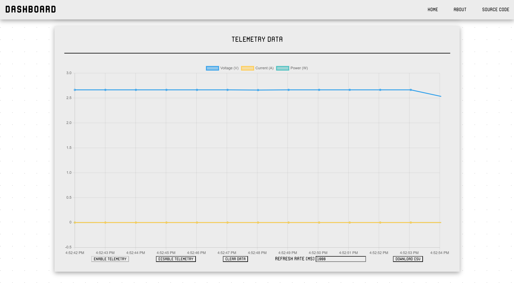

# Junior Design Project

## Where to find the code

The most up to date code includes everything in the [`main`](main) directory.
The [`telemetry`](main/telemetry.h) files are for gathering telemetry data to
be sent from the device, like the current use or battery voltage.  The
[`camera`](main/camera.h) files are for reading from the HuskyLens camera and
calculating the angle/offset of the vehicle relative to the line.  The
[`api`](main/api.h) files are for setting up the webserver that both allows
devices to access the dashboard webpage and provides an API for clients to
control the vehicle. The webpage accesses this API and presents the data on a
user-friendly GUI. The webpage and other web files are stored in the
[`www`](main/data/www) directory. The [`main`](main/main.ino) file holds the
setup and loop functions.

## State Diagram

## UML Diagram

## Software Documentation Plan

The device device provides an API for use over HTTP. By connecting to the
vehicle's WiFi network, users can control the vehicle and view data about it.
This API allows language-agnostic programming support, and easy integration
into a GUI, such as a web or mobile app.

This API will provide detailed information about the status of the vehicle and
its power supply, which will be educational for the students because it will
introduce them to concepts such as power, voltage, and current. Being able to
manipulate the vehicle and observe how its power supply reacts will help them
develop an intuition for these concepts. This also ties into the requirement
that user will be able to see the instantaneous power draw over time during the
competition.

## Using the Dashboard

To access the vehicle dashboard, first turn on the vehicle and connect to its
WiFi network (The SSID is "ECE362TeamBGP"). Next, open a web browser and
navigate to the IP of the vehicle. This can be found by checking the serial
output as the vehicle starts up (It defaults to 192.168.4.1). For connecting to
serial, attach a USB cable from your device to the vehicle and use an
application like screen or the Arduino IDE to view the output. Set the baud
rate to 115,200.

You should be presented with the following screen:

You can start and stop the vehicle using the "Start" and "Stop" buttons as
shown above.  If you scroll down, you should see the graph which displays
telemetry data. This is shown below.

You can enable and disable updating the telemetry graph by clicking the
"Enable" and "Disable" buttons as shown above. To change how quickly the graph
refreshes with new data, change the value in the box labeled "Telemetry Refresh
(ms)". To download the data as a csv file (for use in Excel or Matlab) click
the "Download csv" button.

## API Usage

The vehicle hosts a webserver on port 80 that both serves the webpage and
provides an API for programmatic usage. The API uses the [JSON-RPC](https://www.jsonrpc.org/)
protocol [over HTTP](https://www.simple-is-better.org/json-rpc/transport_http.html)
and can be accessed on the `/api` route.

### API Functions

| Method Name | Parameters      | Return                                                              | Description                                                                                 |
|-------------|-----------------|---------------------------------------------------------------------|---------------------------------------------------------------------------------------------|
| start       | none            | none                                                                | Starts the vehicle                                                                          |
| stop        | none            | none                                                                | Stops the vehicle                                                                           |
| set_speed   | [speed: number] | none                                                                | Sets the default motor speed of the vehicle                                                 |
| telemetry   | none            | `{ "battery_v": number, "current_ma": number, "power_mw": number }` | Requests telemetry data from the vehicle. This includes battery voltage, current, and power |
